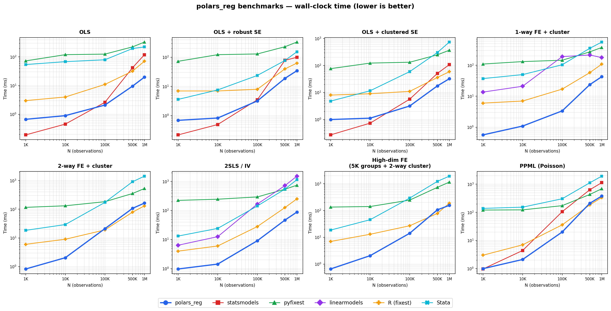

# polars_reg

Fast econometric regressions for Python, built on [Polars](https://pola.rs/) and Rust. Covers OLS, IV, panel, and limited-dependent-variable models with robust and clustered standard errors — validated against Stata and R to 5+ decimal places. Also accepts pandas DataFrames.

The computational backend is written in Rust (via PyO3), with parallel demeaning and sandwich estimators powered by Rayon. On fixed-effects and clustered models, polars_reg matches or beats R/fixest and is 2–8× faster than statsmodels, pyfixest, and linearmodels.

## Features

### Regression Estimators

- **OLS / WLS** — analytic weights (`weights=`) and frequency weights (`fweights=`)
- **High-dimensional fixed effects** — reghdfe-style absorption via iterative demeaning
- **2SLS / IV** with first-stage F-statistics and weak instrument diagnostics
- **LIML** — limited information maximum likelihood
- **GMM-IV** — two-step efficient GMM with Hansen J test
- **Panel**: fixed effects (within), random effects (Swamy-Arora GLS), first-difference
- **Dynamic panel GMM**: Arellano-Bond (difference GMM) and Blundell-Bond (system GMM)
- **Probit / Logit** — MLE with marginal effects and odds ratios
- **Quantile regression** — median and arbitrary quantiles via IRLS
- **PPML** — Poisson pseudo-maximum likelihood for count/gravity models

### Standard Errors

- **Robust** — HC0, HC1 (Stata's `robust`), HC2, HC3
- **Clustered** — one-way and multi-way (Cameron-Gelbach-Miller)
- **HAC** — Newey-West for time series
- **Driscoll-Kraay** — robust to cross-sectional dependence in panels
- **Bootstrap** — pairs bootstrap and wild cluster bootstrap (Webb 6-point)

### Convenience Features

- **GroupBy regression** — run any estimator per group (e.g., per stock or industry)
- **regtable** — side-by-side regression tables (estout/esttab-style) with LaTeX and HTML export
- **Coefficient plots** and **added-variable plots** via Altair
- **Diagnostics** — Wald test, Hausman test (FE vs RE), Kleibergen-Paap, Stock-Yogo weak IV
- **Formula API** with interaction terms (`x1*x2`, `x1:x2`) and indicator expansion (`i.group`)

### Validation

- **Stata equivalence** — `to_stata()` generates the matching Stata command for any specification
- **R equivalence** — `to_r()` generates the matching fixest/lm call
- **Automated comparison** — `compare_stata()` and `compare_r()` run the command and diff coefficients

## Performance



Wall-clock time across dataset sizes (1K–1M rows), compared to statsmodels, pyfixest, linearmodels, R/fixest, and Stata:

- **Plain OLS**: statsmodels is faster below ~100K rows due to lower call overhead
- **FE, IV, and clustered models**: polars_reg is consistently faster than other Python packages, especially at smaller N
- **At large N**: performance converges with R/fixest — the difference between the two is roughly negligible

Reproduce with `python benchmarks/generate_chart.py` (requires R with fixest; Stata optional).

## Installation

```bash
pip install polars_reg
```

## Quick Start

```python
import polars as pl
import polars_reg as pr

df = pl.read_csv("data.csv")

# OLS with robust standard errors
result = pr.ols("y ~ x1 + x2 + x3", data=df, vcov="HC1")
print(result.summary())

# OLS with absorbed fixed effects and clustered SEs (like Stata's reghdfe)
result = pr.ols("y ~ x1 + x2 | firm_id + year_id", data=df, cluster=["firm_id"])

# IV / 2SLS
result = pr.iv2sls("y ~ x_exog || x_endog ~ z1 + z2", data=df)

# Panel fixed effects
result = pr.panel_fe("y ~ x1 + x2", data=df, entity="firm_id", time="year_id")

# GroupBy: run regression per industry
grp = pr.groupby_reg(pr.ols, "y ~ x1 + x2", df, group_by="industry")
grp.coef_table()  # stacked Polars DataFrame

# Side-by-side comparison table
pr.regtable(m1, m2, m3, labels=["OLS", "Robust", "FE"])

# Probit / Logit
result = pr.logit("y_binary ~ x1 + x2", data=df, cluster="firm_id")
pr.marginal_effects(result, at="mean")
pr.odds_ratios(result)

# Quantile regression (median)
result = pr.quantreg("y ~ x1 + x2", data=df, tau=0.5)

# Dynamic panel GMM
result = pr.panel_ab("y ~ x1", data=df, entity="firm_id", time="year_id")
result = pr.panel_sys_gmm("y ~ x1", data=df, entity="firm_id", time="year_id")

# PPML (Poisson / gravity model)
result = pr.ppml("count ~ x1 + x2", data=df, cluster=["firm_id"])

# Coefficient plot (interactive Altair chart)
result.coefplot()
pr.coefplot(m1, m2, m3, labels=["OLS", "IV", "FE"])

# Added-variable (partial regression) plot
result.avplot("x1")

# Out-of-sample prediction
preds = result.predict(new_df)
intervals = result.predict_interval(new_df, alpha=0.05)  # fit, se, lower, upper

# Access results
result.coefficients  # coefficient vector
result.se            # standard errors
result.tstat         # t-statistics
result.pvalue        # p-values
result.confint()     # confidence intervals
result.coef_table()  # Polars DataFrame
result.wald_test(R)  # Wald test for linear restrictions
result.predict(new_df)   # out-of-sample predictions
result.coefplot()        # coefficient plot
result.avplot()          # added-variable plots
```

## Formula Syntax

| Formula | Meaning | Stata | R |
|---------|---------|-------|---|
| `y ~ x1 + x2` | OLS | `reg y x1 x2` | `lm(y ~ x1 + x2)` |
| `y ~ x1 + x2 - 1` | No intercept | `reg y x1 x2, noconstant` | `lm(y ~ x1 + x2 - 1)` |
| `y ~ x1 \| fe1 + fe2` | Absorbed FE | `reghdfe y x1, absorb(fe1 fe2)` | `feols(y ~ x1 \| fe1 + fe2)` |
| `y ~ x1 \|\| x_end ~ z1 + z2` | IV/2SLS | `ivregress 2sls y x1 (x_end = z1 z2)` | `feols(y ~ x1 \| 0 \| x_end ~ z1 + z2)` |
| `y ~ x1 \| fe1 \| x_end ~ z1` | IV + FE | `ivreghdfe y x1 (x_end = z1), absorb(fe1)` | `feols(y ~ x1 \| fe1 \| x_end ~ z1)` |
| `y ~ x1*x2` | Full factorial | `reg y c.x1##c.x2` | `lm(y ~ x1 * x2)` |
| `y ~ x1:x2` | Interaction only | `reg y c.x1#c.x2` | `lm(y ~ x1:x2)` |
| `y ~ i.group + x1` | Indicator dummies | `reg y i.group x1` | `lm(y ~ factor(group) + x1)` |
| `y ~ i.group*x1` | Indicator × continuous | `reg y i.group#c.x1` | `lm(y ~ factor(group) * x1)` |

## Estimators

| Function | Description |
|----------|-------------|
| `ols()` | OLS/WLS with optional FE absorption |
| `iv2sls()` | Two-stage least squares |
| `liml()` | Limited information maximum likelihood |
| `gmm_iv()` | Two-step efficient GMM |
| `panel_fe()` | Panel fixed effects (within) |
| `panel_re()` | Panel random effects (Swamy-Arora GLS) |
| `panel_fd()` | Panel first-difference |
| `panel_ab()` | Arellano-Bond dynamic panel GMM |
| `panel_sys_gmm()` | Blundell-Bond system GMM |
| `probit()` | Probit MLE |
| `logit()` | Logit MLE |
| `quantreg()` | Quantile regression (IRLS + bootstrap) |
| `ppml()` | Poisson pseudo-maximum likelihood |
| `coefplot()` | Coefficient plot with CIs (Altair) |
| `groupby_reg()` | Run any estimator per group |
| `regtable()` | Side-by-side regression table |
| `marginal_effects()` | Probit/logit marginal effects |
| `odds_ratios()` | Logit odds ratios with delta-method SEs |
| `hausman_test()` | Hausman specification test (FE vs RE) |

## Standard Error Options

- `vcov="iid"` — homoskedastic (default)
- `vcov="HC1"` — heteroskedasticity-robust (Stata's `robust`)
- `vcov="HC0"`, `"HC2"`, `"HC3"` — other HC variants
- `cluster=["firm_id"]` — one-way clustered
- `cluster=["firm_id", "year_id"]` — two-way clustered (Cameron-Gelbach-Miller)
- `vcov="NW"` — Newey-West HAC (requires `time=`)
- `vcov="DK"` — Driscoll-Kraay (requires `time=`)
- `vcov="bootstrap"` — pairs bootstrap
- `vcov="wildboot"` — wild cluster bootstrap (requires `cluster=`)

## Stata / R Equivalence

Generate equivalent code to verify results in Stata or R:

```python
# Stata code
print(pr.to_stata("ols", "y ~ x1 + x2 | firm_id", cluster=["firm_id"]))
# → reghdfe y x1 x2, absorb(firm_id) vce(cluster firm_id)

# R code
print(pr.to_r("ols", "y ~ x1 + x2 | firm_id", cluster=["firm_id"]))
# → library(fixest)
#   model <- feols(y ~ x1 + x2 | firm_id, data=df, vcov=~firm_id)
```

## Documentation

- **[Showcase notebook](notebooks/showcase.ipynb)** — full tour of all features ([rendered PDF](notebooks/showcase.pdf))
- **API reference** — generate locally with `uv run pdoc polars_reg --docformat google` (serves at http://localhost:8080), or build static HTML with `uv run pdoc polars_reg -o docs/api --docformat google`

## Requirements

- Python >= 3.11
- Polars >= 1.0
- NumPy >= 1.24
- SciPy >= 1.10
- pandas (optional — for pandas DataFrame input)
- Altair (optional — for plotting)
